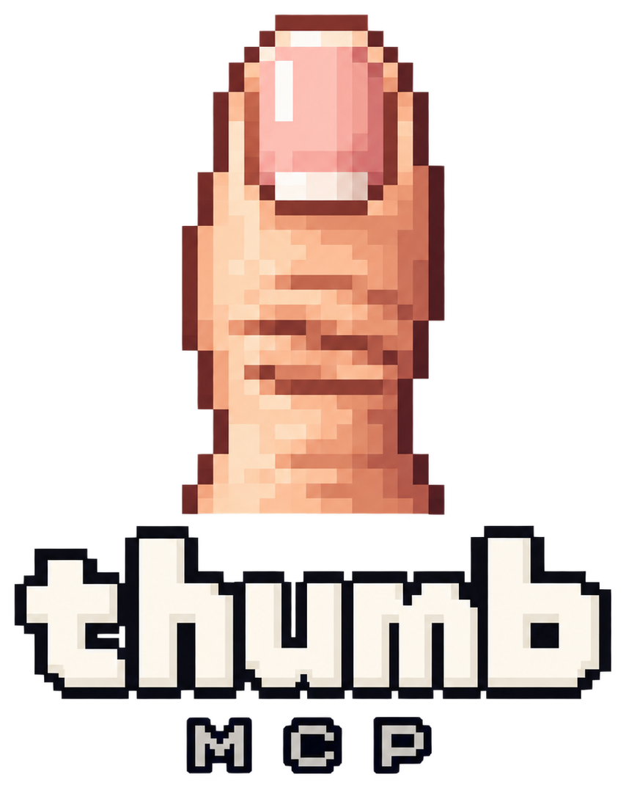

<p align="center">
  
</p>

<h1 align="center">thumb</h1>

<p align="center">
  <b>Give your Claude a thumb.</b><br>
  An open-source MCP server that lets Claude use your iPhone through macOS <b>iPhone Mirroring</b> —
  see the screen, tap, type, scroll, send messages, run recorded skills.
</p>

<p align="center">
  <a href="https://github.com/ishan-crd/thumb-mcp/actions/workflows/test.yml"></a>
  
  
  
</p>

---

```
you:    open Settings and turn on Wi-Fi
claude: open_app("Settings") → scroll_to("Wi-Fi", tap=True) → tap_text("Wi-Fi")   ✓

you:    text Rohit "running 10 min late"
claude: send_message("Rohit", "running 10 min late")   → shows you the draft
you:    send it
claude: confirm_send()   ✓ delivered
```

No jailbreak, no developer profile, no WebDriverAgent. thumb drives the same mirroring window you already
use by hand: it reads the screen with Apple's on-device Vision OCR (`describe_screen`, `tap_text`,
`wait_for_text`) and sends real input events. One-call shortcuts (`open_app`, `search_in_app`,
`send_whatsapp`, `open_expo_app`) run whole flows without a screenshot between every step.

## Contents

1. [Requirements](#1-requirements)
2. [Install](#2-install)
3. [Grant permissions](#3-grant-permissions)
4. [Connect it to Claude](#4-connect-it-to-claude)
5. [First run](#5-first-run)
6. [Tools](#6-tools)
7. [Skills: record once, replay after](#7-skills-record-once-replay-after)
8. [Exploring an app](#8-exploring-an-app)
9. [Constraints worth knowing](#9-constraints-worth-knowing)
10. [Troubleshooting](#10-troubleshooting)
11. [Development](#11-development)
12. [Implementation notes](#12-implementation-notes)

---

## 1. Requirements

| | |
|---|---|
| Mac | macOS 15 Sequoia or later, Apple silicon |
| iPhone | iOS 18 or later |
| Apple Account | Mac and iPhone signed into the **same** account, Bluetooth + Wi-Fi on |
| iPhone Mirroring | Paired and working **by hand once** — open the app, connect, see your phone |
| uv | [Astral's uv](https://docs.astral.sh/uv/) — installs Python 3.11+ and the server for you |

iPhone Mirroring is not available in every region (notably the EU and China). If the app is missing or
refuses to connect, that is an Apple-side restriction, not this server.

```bash
# uv, if you don't have it
curl -LsSf https://astral.sh/uv/install.sh | sh
```

## 2. Install

**Straight from GitHub, no clone** — `uvx` fetches, builds and caches it on first use:

```bash
uvx --from git+https://github.com/ishan-crd/thumb-mcp thumb-mcp
```

That starts the server on stdio (it waits for an MCP client — that's normal; `Ctrl-C` to stop). The
same command goes into your Claude config in step 4.

**From a checkout**, to hack on it:

```bash
git clone https://github.com/ishan-crd/thumb-mcp && cd thumb-mcp
uv sync
uv run thumb-mcp
```

> Once the package is on PyPI, `uvx thumb-mcp` is all you need.

## 3. Grant permissions

macOS grants screen and input permissions to the **application that launches the server**, not to
Python. From Claude Desktop, *Claude Desktop* needs the grants. From Claude Code in Terminal, *Terminal*
does; in iTerm, *iTerm*; in Cursor, *Cursor*.

Grant both, then **fully quit and reopen** that app (macOS only applies a new Screen Recording grant on
relaunch):

| Permission | Where | Why |
|---|---|---|
| **Screen Recording** | System Settings › Privacy & Security › *Screen & System Audio Recording* → **+** → add the host app → toggle on | Capturing the mirrored screen. Without it, screenshots are blank |
| **Accessibility** | System Settings › Privacy & Security › *Accessibility* → **+** → add the host app → toggle on | Sending taps, swipes and keystrokes. Without it, input is silently dropped |

Not sure which app is the host? Ask the server — it names it:

```bash
uv run --with git+https://github.com/ishan-crd/thumb-mcp python -c "import thumb.server as s; print(s.device_info())"
# or from a checkout:
uv run python -c "import thumb.server as s; print(s.device_info())"
```

That prints permissions, the host process it detected, window geometry, the coordinate space, and whether
the phone is currently streaming. Fix anything it reports before continuing.

## 4. Connect it to Claude

**Claude Code** (one command, remembered per machine):

```bash
claude mcp add thumb -- uvx --from git+https://github.com/ishan-crd/thumb-mcp thumb-mcp
```

From a checkout instead:

```bash
claude mcp add thumb -- uv --directory /absolute/path/to/thumb-mcp run thumb-mcp
```

**Claude Desktop** — Settings › Developer › Edit Config, which opens
`~/Library/Application Support/Claude/claude_desktop_config.json`:

```json
{
  "mcpServers": {
    "thumb": {
      "command": "uvx",
      "args": ["--from", "git+https://github.com/ishan-crd/thumb-mcp", "thumb-mcp"]
    }
  }
}
```

Restart Claude Desktop afterwards. For a checkout use `"command": "uv"` with
`"args": ["--directory", "/path/to/thumb-mcp", "run", "thumb-mcp"]`.

**Other MCP clients** (Cursor, Windsurf, Zed, …) take the same `command` + `args`; the server speaks
plain stdio MCP.

> GUI apps don't inherit your shell `PATH`. If the client reports `uvx: command not found`, use the
> absolute path from `which uvx` (usually `~/.local/bin/uvx`).

## 5. First run

1. Open **iPhone Mirroring** on the Mac and connect. Leave the window visible — don't cover it.
2. Lock the iPhone and put it down. Mirroring stops the moment you pick it up.
3. In Claude, ask for something small and visible:

```
take a screenshot of my iPhone
what's on screen right now?               → describe_screen()
open Settings and scroll to General        → open_app + scroll_to
text Rohit "on my way" — draft only        → send_message(..., send=False)
```

Claude drafts messages and shows you the screenshot first; nothing is sent until you say so
(`confirm_send`). If a tool reports *"iPhone in Use"*, the phone was picked up — lock it and call
`reconnect()`.

## 6. Tools

### Composite flows — prefer these

Each is one call that runs a known-good sequence and returns the **settled** screen. Driving a phone one
primitive at a time is slow and error-prone — every tap needs a screenshot to aim it, and every
screenshot is a round trip.

| Tool | What it does |
|---|---|
| `describe_screen(include_image=False)` | **Every text element on screen with tap coordinates.** Text-only by default — far cheaper than an image |
| `tap_text("Wallet")` | **Tap on-screen text by name.** No coordinates, survives layout changes |
| `wait_for_text("Done", gone=False)` | Wait for text to appear or disappear — works on screens that never go still |
| `open_app("insta")` | Home → Spotlight → type → launch top hit. Aliases resolve (`insta` → Instagram) |
| `search_in_app("instagram", "akshit")` | **Open an app and search inside it in one call** |
| `open_url(url)` | Open a URL or deep link (`exp://`, `maps://`), verified |
| `open_expo_app(url=None, use_dev_build=False)` | **Run your Expo dev-server project on the phone.** Detects the Mac's LAN address, hands off to Expo Go |
| `send_message(recipient, text, send=False)` | **iMessage.** Resolves a real contact, types the body, **drafts by default** and returns a screenshot |
| `send_whatsapp(recipient, text, contact_index=1, send=False)` | **WhatsApp.** Same shape; `contact_index` picks the row when names collide |
| `confirm_send()` | Press Send on the draft already on screen (~2s), verify, rebuild-and-send if the tap missed |
| `scroll(direction, amount=0.6)` | Scroll `down` / `up` / `left` / `right` by a fraction of the screen |
| `scroll_to("General", tap=False)` | Scroll until text appears, optionally tap it |
| `go_back()` / `go_to_root(max_steps=5)` | Back chevron once / all the way to the app's root screen |
| `tap_and_type(x, y, text)` | Focus a field and type, waiting for focus first |
| `survey_home(max_pages=4)` | One screenshot per Home Screen page, in a single call |
| `get_orientation()` | Portrait or landscape |

Apps with built-in layouts (`APP_PROFILES`): Messages, WhatsApp, Instagram, X, Threads, YouTube,
Spotify, Maps, App Store, Blinkit. Unknown apps fall back to a generic layout rather than failing.

### Primitives

| Tool | What it does |
|---|---|
| `screenshot()` | The mirrored screen, plus the coordinate space to use |
| `tap(x, y)` · `double_tap(x, y)` · `long_press(x, y, hold_ms=700)` | Taps at a device point |
| `swipe(x1, y1, x2, y2, duration_ms=300)` | Flick/scroll — stays under iOS's long-press threshold |
| `drag(x1, y1, x2, y2)` | Pick up, move, drop — deliberately slower than a swipe |
| `type_text(text)` · `press_key(key)` | Type into the focused field (unicode + emoji); `return`, `delete`, `escape`, `tab`, `space`, arrows |
| `home()` · `app_switcher()` · `spotlight()` | Driven via the app's real menu items, verified |
| `wait_until_settled(timeout_s=5)` | Poll until the screen stops animating |
| `device_info()` | Geometry, permissions, host app, streaming state |
| `reconnect()` | Press Connect/Resume after the phone was picked up |

Composite flows settle internally; `wait_until_settled()` is only needed after a raw `tap`/`swipe`.

### Coordinates

All coordinates are **device points**, origin top-left of the phone screen — never Mac screen
coordinates, never pixels of the returned image. `screenshot()` states the space every time (e.g.
`393 x 852`). The image is downscaled to keep token cost sane, so use the numbers it reports. Window
bounds are re-read on every call, so moving, zooming or re-docking the mirroring window mid-session is
safe.

### Reading the screen

```
describe_screen()      -> "(302, 175) Wallet →", "(112, 278) Available $0", ...
tap_text("Wi-Fi")      -> taps it, no coordinates involved
```

Uses Apple's Vision framework locally — no API key, no network, nothing leaves the machine. Two things
to know: it reports where the **text** is (for Home Screen icons that's the label — tapping it does not
launch the app; use `open_app()`), and only what is currently visible is recognised. Recognition uses
Vision's accurate mode (fast mode misread "Ishan" as "Ish8n"); set `THUMB_OCR_FAST=1` to trade back.

### Draft, confirm, send

Sending is two calls, not one:

```
send_message("Himanshu", "hey")   # or send_whatsapp(...)
   -> drafts, returns a screenshot, sends nothing
   -> show it to the user and ask
confirm_send()                    # only after they agree
```

`send_message` is the most dangerous tool here — a text is irreversible and goes to a real person — so it
refuses rather than guesses: it proves it is on a blank New Message sheet before typing a recipient
(iOS resumes Messages *inside* a conversation, which once produced "Rohithi"), clears the body first,
and fails loudly when no contact matches. WhatsApp does not rank exact matches first ("Rohit" returns
`Rohit sir COA` before `Rohit`), which is why `send_whatsapp` drafts by default and takes a
`contact_index`.

### Running your Expo project on the phone

```
open_expo_app()                     # exp://<mac-lan-ip>:8081, straight into Expo Go
open_expo_app(use_dev_build=True)   # http:// page, picks "Development Build"
```

The phone cannot reach your Mac's `localhost` — on the device that means the phone itself. The flow
detects the Mac's LAN address and refuses a localhost URL with the right one instead of failing quietly.

## 7. Skills: record once, replay after

Hand-writing a flow means measuring landmarks for every control it touches. Recording lets you
demonstrate it instead:

```
start_recording()
   ...drive the phone by hand in the mirroring window...
stop_recording("open-wifi", app="Settings", description="Settings → Wi-Fi")

run_skill("open-wifi")
list_skills() · get_skill("open-wifi") · delete_skill("open-wifi")
```

A skill is a list of **device-point** steps plus the app to open first — no pixels, no absolute screen
coordinates — so one recorded on a small window replays on a zoomed one. The recorder is listen-only,
ignores the server's own events (replaying while recording can't record itself), and replay starts from
the app root and reports any step that changed nothing. Gestures are classified from raw events (tap /
long press / swipe); consecutive keystrokes collapse into one `type_text`. Skills live in
`~/.thumb/skills` (`THUMB_SKILLS_DIR` to move them).

## 8. Exploring an app

```
explore_app("Settings", max_screens=8, max_actions=25, max_depth=3)
```

Walks an app breadth-first and returns a map: which screens exist and which control reaches each.
Screens are identified by the **set of text on them**, not pixels. Nothing matching the deny list is
ever tapped — send, pay, order, delete, log out, call, anything with a currency symbol or plan wording
(a live crawl once reached `"$ 75.00 a month"`). Skipped controls are reported. Every action is a real
tap (~4–6 s each), so it takes minutes, not seconds. Dismiss modals before exploring — an app resumed on
an upsell sheet traps the crawl inside it.

## 9. Constraints worth knowing

- **Mirroring stops the moment you pick up the phone.** Apple's design. Lock it, set it down,
  `reconnect()`.
- **The mirroring window must be visible and unobscured.** Input goes through the system HID event
  stream, so it lands on whatever is at that screen location. Every input call raises the window first.
- **Input steals focus and borrows the cursor.** The cursor is restored afterwards; focus is not. Not a
  fit for running in the background while you type elsewhere.
- **The phone is real.** Real accounts, real messages, real purchases. Prefer the composite flows over
  raw `swipe` — they start from safe empty bands and verify each step.
- **Some iOS gestures are unreachable through mirroring**: Control Centre, Notification Centre,
  edge-swipe-back, and force-quitting from the App Switcher. Tools for them were removed rather than left
  doing nothing.

## 10. Troubleshooting

| Symptom | Cause / fix |
|---|---|
| `iPhone Mirroring app is not running` | Launch it and connect once by hand |
| `showing its setup / Welcome screen` | Not paired yet — the first handshake needs the phone and can't be automated |
| `not streaming … iPhone in Use` | Phone was picked up. Lock it, set it down, `reconnect()` |
| `window exists but is off-screen` | Un-minimise it / bring it to the current Space (the server tries) |
| Blank or black screenshots | Screen Recording not granted to the **host** app, or granted but the app wasn't relaunched |
| Taps do nothing | Accessibility not granted to the **host** app |
| Taps land in the wrong place | Something is covering the mirroring window |
| `uvx: command not found` in Claude Desktop | Use the absolute path (`which uvx`) — GUI apps don't see your shell `PATH` |
| Typed text arrives as `aaaa` / letters trigger shortcuts | You're on an old build; see the keycode notes below and update |

Run `device_info()` first whenever something is off — it names the exact pane and host app.

### Tuning

| Variable | Default | Purpose |
|---|---|---|
| `IPHONE_MIRROR_MAX_EDGE` | `1024` | Max long edge (px) of returned screenshots |
| `IPHONE_MIRROR_DEVICE_SIZE` | auto | Override the coordinate space, e.g. `393x852` |
| `IPHONE_MIRROR_TAP_HOLD_MS` | `80` | Mouse-down hold for a tap |
| `IPHONE_MIRROR_KEY_DELAY_MS` | `12` | Delay between typed characters |
| `IPHONE_MIRROR_ACTIVATE_DELAY_MS` | `150` | Wait after fronting the app before input |
| `IPHONE_MIRROR_EVENT_TARGET` | `hid` | `hid` or `pid` (see implementation notes) |
| `THUMB_OCR_FAST` | unset | `1` uses Vision's fast recognizer |
| `THUMB_SKILLS_DIR` | `~/.thumb/skills` | Where recorded skills are stored |

## 11. Development

```bash
git clone https://github.com/ishan-crd/thumb-mcp && cd thumb-mcp
uv sync --dev
uv run pytest          # pure-logic suite, ~1 s, no phone or permissions needed
```

The tests pin the pure logic where the real bugs lived — coordinate mapping, settle/assert, keycodes
(letters once all mapped to keycode 0, so "instagram" arrived as "aaaaaaaaa"), text ranking, app
aliases, error messages. CI runs them on macOS for Python 3.11 and 3.13; a `v*` tag publishes to PyPI.

### Layout

| Path | Holds |
|---|---|
| `src/thumb/server.py` | The MCP tools — thin wrappers |
| `src/thumb/flows.py` | Step sequences behind the composite tools |
| `src/thumb/landmarks.py` | Positions and per-app layouts as **screen fractions** (`APP_PROFILES`) |
| `src/thumb/drafts.py` | Flows that work but aren't registered as tools yet (Blinkit) |
| `tests/` | Pure-logic tests |

### Adding an app

One entry in `APP_PROFILES` in `landmarks.py`, no other changes:

```python
AppProfile("Spotify", search_tab=(2, 3), aliases=("spot",))
```

`search_tab` is `(slot, total_slots)` in the bottom tab bar; `aliases` are the other names someone might
say.

### Adding a flow

Write a function in `flows.py` taking `session` first and returning `(report, image)`, then register a
`@server.tool` wrapper in `server.py`. Two rules keep flows reliable: coordinates are **fractions of the
screen**, never absolute points; and **verify anything that changes the screen** — menu commands and
taps both no-op silently, so use `settle()` and compare frames rather than trusting a step worked.

## 12. Implementation notes

Things that are silently wrong if done the obvious way — kept here so nobody re-learns them.

- **Typing must press real keycodes.** A unicode-payload event on keycode 0 is relayed as the physical
  `A` key, so every character arrives as `a`. Characters map to US-ANSI keycodes with Shift; only
  characters with no key (emoji, accents) use the unicode path.
- **Modifier flags must be set explicitly, including to zero,** or a leftover Command flag rides along —
  typing "instagra**m**" once delivered Cmd-M and minimised the mirroring window.
- **Input goes through the HID tap, not `CGEventPostToPid`.** iPhone Mirroring ignores per-process
  events entirely (frame delta `0.007` vs `100.18`). `IPHONE_MIRROR_EVENT_TARGET=pid` forces the other
  path if a future macOS honours it.
- **Vertical scrolling needs wheel events and a warped cursor.** A vertical click-drag does nothing;
  scroll events go to whatever is under the *system* cursor, which must be moved with
  `CGWarpMouseCursorPosition`.
- **Swipes are driven off the wall clock.** Naive sleeps overshot a 350 ms gesture to 485 ms, past
  iOS's long-press threshold — which turns a Home Screen swipe into an icon drag that rearranges apps.
- **Launch apps by tapping the Top Hit, not Return.** Return in Spotlight frequently does nothing.
- **Never use Escape to unwind inside an app** — it is "go back" and drops out to the Home Screen.
  Flows back out with the app's own chevron instead.
- **Confirm by reading the screen, not by how it looks.** Three appearance-based checks for the
  app-handoff alert all produced false positives; it now OCRs the alert's buttons. Vision often returns
  two buttons as one block (`"Cancel Open"`).
- **Apps resume where you left them and cannot be force-quit** through mirroring; `go_to_root()` backs
  out with the chevron because that is what is reachable.
- **Fields are cleared with backspace, not Cmd-A** — the synthesised Command flag isn't honoured.
- **Silent no-ops are the failure mode to design against.** `flows.assert_changed()` fails loudly where a
  no-op is always a bug, and `scroll()` reports when it did not move.

## License

MIT
